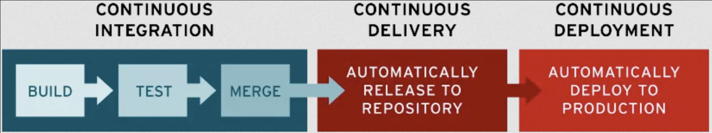
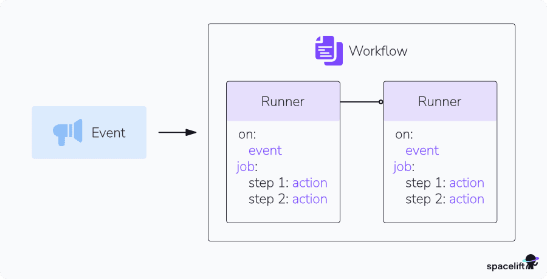
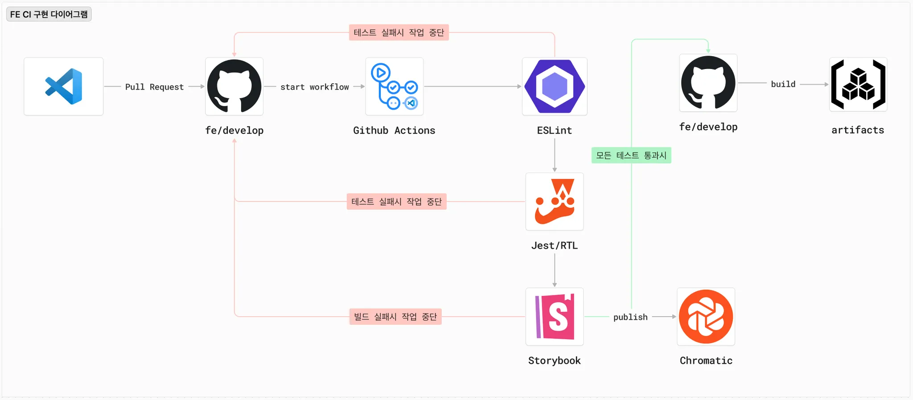
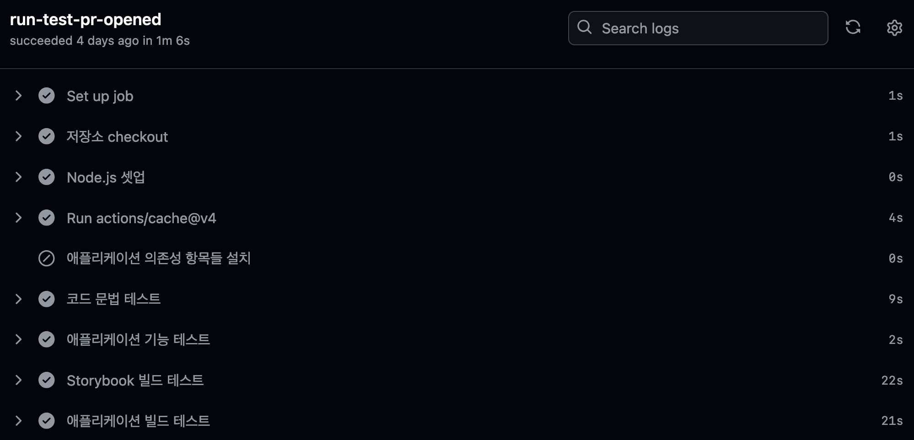
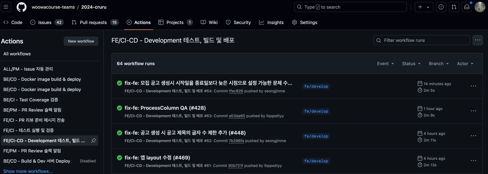

# GitHub Actions를 이용한 프론트엔드 애플리케이션의 CI/CD 구축

## CI/CD의 개념과 필요성

애플리케이션 개발 과정에서 코드 변경은 필연적입니다. 크루루 서비스의 프론트엔드 영역에서도 1-2주 단위의 짧은 스프린트를 거쳐 코드 변경이 이루어지고 있지요. 이처럼 팀 단위의 코드 작업 및 배포가 빠른 페이스로 이어지다 보니 아래와 같은 문제가 생기기 시작했습니다.

- 팀에서 정한 코드 컨벤션과 어긋나는 작업 결과물 발생
- 새로 개발된 컴포넌트 및 훅(hook) 코드의 검증을 로컬 개발 환경에서의 수동 테스트에만 의존
- 새로운 배포 작업의 전 과정을 수동으로 진행하면서 발생하는 시간 소모 및 휴먼 에러 가능성

이러한 문제를 해결하기 위해 등장한 개념이 바로 **CI/CD**입니다. 저희 크루루 팀의 프론트엔드 파트에서도 CI/CD 파이프라인을 자체적으로 구현한 이후부터, 기능 개발 및 개선 작업 과정에서 효율이 크게 늘어나는 것을 실감할 수 있었어요. 이번 글에서는 CI/CD의 개념을 먼저 살펴보고, CI/CD를 구현하는 도구 중 하나인 GitHub Actions를 이용하여 Webpack 기반 프론트엔드 애플리케이션의 CI/CD 파이프라인을 직접 구축하는 과정을 다루어 보겠습니다.

### CI/CD란?

CI/CD는 지속적 통합(Continuous Integration)과 지속적 제공/배포(Continous Delivery/Deployment) 개념을 합친 용어입니다. 각각의 용어가 가진 의미를 조금 더 자세히 들여다 보면 다음과 같습니다.


(이미지 출처: RedHat 공식 문서 "CI/CD란?")

#### CI(Continuous Integration)

CI(Continuous Integration; 이하 CI)는 개발자들의 코드 변경 사항을 지속적으로 통합하는 작업입니다. 코드의 변경 사항이 생겼을 때 애플리케이션 빌드와 함께 다양한 수준의 자동화된 테스트를 실행함으로써, 검증된 코드를 언제든 배포 가능한 상태로 유지하는 것이 목적입니다.

#### CD(Continuous Delivery/Deployment)

CD(Continuous Delivery/Deployment; 이하 CD)는 아래의 두 가지 작업을 포함하고 있는 개념입니다. 요약하자면, CD는 프로젝트 저장소와 운영 환경에 새로운 코드를 자동으로 반영하는 연속적인 과정이라고 보시면 되겠습니다.

- 지속적 제공(Continuous Delivery) : 개발자들의 코드 변경 사항을 저장소(Repository)로 릴리즈하는 작업
- 지속적 배포(Continuous Deployment) : 새롭게 업데이트 된 코드를 운영 환경에 배포하는 작업

### CI/CD가 왜 필요할까?

개별 기능 브랜치(`feat`)에서 새로 구현한 코드를 개발 브랜치(`dev`)로 합치는 과정을 예시로 떠올려 보겠습니다. 사전에 진행해야 할 일들이 많겠지요. 우선 코드에 대한 문법 검사, 기능 검증이 필요할 겁니다. 이 코드로 애플리케이션을 빌드했을 때 이상 없이 동작하는지 검증하는 단계도 필요합니다.

이러한 테스트가 모두 통과된 경우에만 개발 브랜치(`dev`)로 새로운 코드가 합쳐지도록 만든다면, 변경된 코드의 신뢰성과 애플리케이션의 안정성을 함께 높일 수 있겠지요? 또한 코드 변경이 빈번하게 일어나는 개발 환경에서 위의 모든 단계들이 잘 자동화 되어 있다면, 개발자들은 다른 방해요소 없이 코드 품질에만 집중할 수 있게 될 것입니다. 이처럼 잘 구축된 CI/CD 파이프라인은 코드의 무결성 검증, 빌드 및 배포 과정을 모두 자동화하여 애플리케이션의 안정성은 물론 개발팀의 생산성까지 함께 향상시킬 수 있습니다.

## GitHub Actions 소개

GitHub Actions는 GitHub 사용자라면 누구나 무료로 이용 가능한 빌드, 테스트 및 배포 플랫폼입니다. 코드 저장소와 동일한 환경에서 CI/CD 파이프라인을 만들 수 있게 도와주지요. 다른 여러 도구들에 비해 GitHub Actions가 가지는 이점은 다음과 같습니다.

1. GitHub 저장소와의 연계가 간편합니다. 별도의 외부 서비스 연동 없이 GitHub 안에서 모든 것이 이루어집니다.
2. 프로젝트 환경과 특성에 맞는 최적화된 파이프라인을 쉽게 만들 수 있습니다. YAML 형식의 파일 만으로 원하는 작업을 트리거 조건과 함께 세세하게 설정할 수 있습니다.
3. 무료입니다. 개인 혹은 소규모의 팀 프로젝트를 운영할 때 비용 부담 없이 사용할 수 있습니다.

### 주요 용어 및 개념

도구를 쓸 때 가장 중요한 것은 그 도구가 제공하는 고유의 언어에 익숙해지는 것입니다. 우선, GitHub Actions에서 사용되는 주요 용어와 개념을 간단히 짚고 넘어가겠습니다. 아래 이미지를 함께 참고하면서 살펴주세요.


(이미지 출처 : spacelift.io)

#### Workflow

**하나 이상의 Job을 실행할 수 있는 자동화 된 작업의 단위**입니다. 해당 GitHub 저장소의 Actions 탭에서 정의한 특정 이벤트가 발생했을 때 실행됩니다. 이때 실행 조건으로 설정할 이벤트의 종류는 여러분이 정하실 수 있습니다. 이를테면, 특정 브랜치에 새로운 코드가 Push 되거나 Pull Request가 생성되었을 때와 같은 조건을 붙일 수 있겠지요.

Workflow는 YAML 형식의 파일을 통해 정의할 수 있습니다. 프로젝트의 `root` 경로를 기준으로 `.github/workflows/` 경로에 해당 파일을 위치시키면, 위에서 설정한 트리거 조건이 실행되었을 때 GitHub의 Actions 탭에 자동으로 등록됩니다.

하나의 Workflow는 하나 이상의 Job과, Job 내부의 개별 태스크를 의미하는 하나 이상의 Step들로 구성됩니다. Job과 Step의 개념에 대해서는 아래에서 다시 소개해 드리겠습니다.

#### Event

위에서 설명드렸던, **Workflow의 실행 조건에 해당하는 이벤트**입니다. 소스 코드의 변경(`push`)이나 신규 PR(`pull request`) 또는 Issue(`issue`)의 발생 등 GitHub의 저장소 혹은 브랜치에서 발생하는 다양한 이벤트를 Workflow의 트리거 조건으로 설정할 수 있습니다.

#### Job

**실행되어야 할 각 작업 단계(Step)들의 모음**을 의미합니다. GitHub Actions는 각각의 Job에게 각기 다른 하나씩의 Runner 인스턴스를 할당하여 실행하도록 조정합니다. 모든 Job이 각기 다른 인스턴스 환경에서 실행되기 때문에, Job을 구성할 때엔 실행 환경과 의존성을 함께 명시해 주셔야 합니다.

하나의 Workflow 안에 정의된 Job들은, 서로 간의 의존성 문제가 없다면 동시에 병렬 실행되기도 합니다. 만약 실행 순서를 꼭 지정해야 하는 Workflow라면, 각각의 Job에 다른 Job에 대한 의존성 정보를 추가하여 이를 구현할 수도 있습니다.

#### Step

**하나의 Job 안에 포함된 개별적인 실행 프로세스**를 의미합니다. 개별적인 쉘 명령어(shell command)나 특정 애플리케이션의 CLI 명령어(CLI command)를 이 단계에 추가할 수 있습니다. 프론트엔드 엔지니어라면 익숙할 `npm install`, `npm run build`와 같은 명령어도 이러한 단계에 포함됩니다. 필요하다면 GitHub나 사용자 커뮤니티에서 제공하는, 여러 Step들의 조합으로 이루어진 Action을 가져와 실행하도록 만들 수도 있습니다.

일반적으로는, 만약 하나의 Step이라도 실패한다면 해당 Step이 포함된 Job이 그대로 종료됩니다. 만약 특정 Step이 실패하더라도 전체 Job이 계속해서 실행되어야 한다면, 해당 Step에 `continue-on-error: true`를 선언하여 이 문제를 방지할 수 있습니다.

#### Action

**여러 Step들을 조합하여 일종의 명령어 세트를 만든 것**입니다. 예를 들어, Runner 인스턴스 안에 `Node.js`를 설치해야 한다고 가정합시다. 이때 필요한 단계별 쉘 명령어들을 조합하여 하나의 Action으로 정의할 수 있는 것입니다. 이렇게 정의한 Action은 다른 Workflow에도 재사용할 수 있습니다. 즉, 프론트엔드 엔지니어링에서 흔히 표현하는 '재사용 가능한 컴포넌트'의 개념으로 접근하면 좋습니다.

#### Runner

**Workflow를 통해 설계한 자동화 흐름을 실제로 실행시켜 주는 인스턴스**입니다. GitHub Actions에서는 두 종류의 Runner 인스턴스가 지원됩니다. GitHub가 호스팅하는 **GitHub-hosted Runner**, 그리고 사용자가 직접 호스팅하여 관리하는 **Self-hosted Runner**가 그것입니다.

- **GitHub-hosted Runner** : GitHub Actions가 기본적으로 지원하는 인스턴스입니다. 별도의 설정 없이 Workflow 파일의 `jobs.<job_id>.runs-on`에 원하는 `Workflow label`값을 넣는 것만으로도 손쉽게 사용할 수 있습니다. 현재 [Ubuntu Linux, Windows, macOS가 지원]됩니다.
- **Self-hosted Runner** : [사용자가 직접 제어하는 클라우드 환경의 VM 인스턴스를 GitHub Actions용 Runner로 활용하는 방법]도 있습니다. 관리의 번거로움이 있지만, 인스턴스 활용 측면에서 더 많은 자율성을 얻을 수 있습니다.

## React 애플리케이션을 위한 CI/CD Workflow 작성

이제 GitHub Actions를 이용해 React 애플리케이션의 CI/CD 파이프라인을 구축하는 과정을 살펴봅시다. Workflow의 내용은 프로젝트의 구조와 필요한 환경 설정, 그리고 구현하고자 하는 자동화 단계의 성격에 따라 크게 달라질 수 있습니다. 여기서는 저희 크루루 프로젝트의 프론트엔드 애플리케이션 배포 과정을 예시로 하되, 최종 배포 타겟을 AWS 대신 GitHub Pages로 변경하여 설명하겠습니다.

### Workflow의 구성안 만들기

무언가를 자동화하려면, 우선 자동화할 작업들의 목록과 순서를 정해야겠지요. 크루루의 프론트엔드 파트는 React 애플리케이션 코드의 Beta 버전을 담고 있는 `fe/develop` 브랜치를 기준으로 CI/CD 구현을 위해 다음과 같이 작업 흐름을 정의했습니다.



1. 신규 기능 브랜치에서 `fe/develop` 브랜치로 PR이 Merge됩니다.
2. Github Actions에 정의한 워크플로우가 실행됩니다. 이 워크플로우는 아래 순서로 동작합니다.
   1. Runner 인스턴스에 전체 코드의 의존성 항목들을 설치합니다.
   2. 코드의 문법 규칙을 점검하는 ESLint 테스트를 실행합니다.
   3. React 기반 훅(hook) 코드의 기능 테스트를 실행합니다.
   4. Storybook을 빌드하여 컴포넌트들의 시각적 요소가 잘 구현되었는지 검증합니다.
   5. 전체 코드를 빌드하여 애플리케이션 실행 흐름에 이상이 없는지 검증합니다.
3. 모든 테스트가 성공했을 경우, 새로운 코드 기반으로 프론트엔드 애플리케이션 빌드가 이루어집니다.
4. 빌드된 새 애플리케이션이 배포됩니다.

### CI 단계의 Workflow 작성

이렇게 정의된 작업 흐름을 GitHub Actions에서 실행하기 위한 Workflow로 하나씩 변환합니다. 우선 CI에 해당하는 테스트-빌드 단계부터 차근차근 Workflow로 작성해 보겠습니다.

#### 실행 조건 명시

```YAML
on:
  push:
    branches:
      - fe/develop
```

우선 Workflow가 실행될 트리거 조건(`on`)을 표기합니다. `push`는 코드에 대한 Merge 등 Push 이벤트가 발생했을 때를 의미합니다. 그 아래에 표기된 `branches`는 위에서 정의한 이벤트를 감지할 저장소 브랜치를 명시합니다.

#### Job에 부여할 Runner 인스턴스 설정

```YAML
jobs:
  run-test-pr-opened:
    if: startsWith(github.head_ref, 'fe-')
    runs-on: ubuntu-22.04
    defaults:
      run:
        working-directory: ./frontend
    env:
      API_URL: ${{ secrets.API_URL }}
      API_VERSION: ${{ secrets.API_VERSION }}
```

각각의 Job에는 `jobs.<Job 이름>`의 형태로 별칭을 붙일 수 있습니다. 이 별칭은 Workflow 내부에서 서로 다른 Job 사이의 의존성을 표기하거나, GitHub Actions의 실행 현황을 살펴볼 때 참고할 수 있습니다.

Job에 대한 설정 내용을 항목 별로 살펴보겠습니다.

- `if: startsWith(github.head_ref, 'fe-')` : Job의 실행 조건을 명시하는 부분입니다. 여기서는 `fe-`로 시작하는 브랜치로부터 PR이 들어왔을 때 실행되도록 정의했습니다.
- `runs-on` : Runner 인스턴스의 OS 환경을 정의합니다. 현재는 [GitHub Actions에서 기본 제공되는 `Workflow label`값]을 넣어서 GitHub-hosted Runner를 사용할 것임을 명시했습니다.
- `defaults` : Job에 속한 모든 Step들에 기본적으로 적용될 실행 환경을 정의합니다. 여기서는 모든 각 Step이 실행될 경로로 `./frontend`를 지정하고 있습니다. 크루루의 프로젝트 저장소는 백엔드(`./backend`)와 프론트엔드(`./frontend`) 코드를 모두 한곳에 모아 관리하는 모노레포 스타일로 운영되고 있기에, 이와 같은 설정을 추가했습니다.
- `env` : 애플리케이션 코드의 실행 환경에 적용될 환경변수를 삽입하는 부분입니다. 여기서 사용한 Secrets의 개념과 이를 GitHub Actions에 적용하는 방법에 대해서는 아래의 공식 문서를 참고해 주세요.
  - [Using secrets in GitHub Actions - GitHub Docs]

#### 단계별 작업 설정

```YAML
steps:
  - name: 저장소 checkout
    uses: actions/checkout@v4

  - name: Node.js 셋업
    uses: actions/setup-node@v4
    with:
      node-version: 20.x

  - uses: actions/cache@v4
    id: npm-cache
    with:
      path: |
        frontend/node_modules
        ~/.npm
      key: ${{ runner.os }}-node-${{ hashFiles('**/package-lock.json') }}

  - name: 애플리케이션 의존성 항목들 설치
    if: steps.npm-cache.outputs.cache-hit != 'true'
    run: npm ci
```

해당 Job에 속한 Step들은 `jobs.<Job 이름>.steps` 아래에 위와 같이 리스트 형태로 정의합니다. 각 Step에는 `name` 키워드로 작업의 내용을 간단히 표기할 수 있는데요. 이렇게 표기된 이름은 추후에 GitHub 저장소의 Actions 탭에서 개별 Workflow 실행 결과를 리뷰할 때, 아래 스크린샷과 같이 어떤 작업에서 문제가 있었는지를 파악할 때 도움이 됩니다.



여기서 `uses`와 `run`의 차이가 궁금하실텐데요. 이 차이를 간단히 정리하면 다음과 같습니다.

- `uses` 키워드는 GitHub 공식 또는 커뮤니티에서 배포한 Action을 불러와 실행할 때 씁니다. 맨 윗줄의 `uses: actions/checkout@v4`는 저장소의 내용을 체크아웃하여 Runner 인스턴스로 다운로드하는 Action을 불러와 실행하라는 뜻입니다.
- `run` 키워드는 앞서 `working-directory`로 설정한 Runner 인스턴스의 기본 경로에서 바로 명령어를 실행할 때 씁니다. 애플리케이션 의존성 항목을 처음 설치할 때 사용하는 `npm ci` 같은 명령어를 여기에 포함시킬 수 있습니다.

끝으로 `actions/cache@v4`를 통해 실행하는 내용이 궁금하신 분도 계실텐데요. 바로 **프론트엔드 애플리케이션 구동에 필요한 의존성 항목에 대하여 GitHub Actions의 실행 환경에 캐쉬를 설정**하는 부분입니다. 매번 같은 Workflow가 실행될 때마다 의존성을 처음부터 끝까지 찬찬히 설치시켜야 한다면 많은 시간이 소요되겠지요.

만약 코드에만 변경이 있을 뿐 의존성 항목에는 아무 변화가 없다면, 이처럼 캐쉬를 설정하고 체크하여 의존성 설치 단계를 뛰어넘도록 만들 수 있습니다. 그리고 아래와 같이 의존성 설치 Step에 `if`문으로 조건을 추가할 수 있겠지요. `actions/cache@v4`를 통해 저장되었던 캐쉬가 hit 되지 않았을 경우에만 전체 의존성 항목을 설치하도록 제한하는 것입니다.

```YAML
- name: 애플리케이션 의존성 항목들 설치
  if: steps.npm-cache.outputs.cache-hit != 'true'
  run: npm ci
```

이에 대한 상세한 내용은 아래의 공식 문서에서 확인하실 수 있습니다.

- [워크플로 속도를 높이기 위한 종속성 캐싱 - GitHub Docs]

이제 애플리케이션 구동과 테스트에 필요한 모든 조건이 Runner 인스턴스에 갖추어졌으니, 본격적인 테스트 실행 단계들을 Workflow에 추가합니다. 빌드 완료된 파일은 다음 단계의 Job에서 가져다 쓸 수 있도록 `fe-dev-dist`라는 이름의 Artifact로 업로드하도록 합니다.

```YAML
- name: 코드 문법 테스트
  run: npm run lint

- name: 애플리케이션 기능 테스트
  run: npm run test -- --passWithNoTests

- name: Storybook 빌드 테스트
  run: npm run build-storybook

- name: 애플리케이션 빌드
  run: npm run build

- name: 빌드된 파일을 artifact로 업로드
  uses: actions/upload-artifact@v4
  with:
    name: fe-dev-dist
    path: frontend/dist
```

### CD 단계의 Workflow 작성

현재 크루루는 AWS 환경에서 서비스를 운영하고 있습니다. 이처럼 퍼블릭 클라우드 인프라 환경에서 우리 프로젝트에 특화된 CD를 구현하려면 정말 많은 사전 작업이 필요합니다. 이 글의 목적은 GitHub Actions를 이용한 Workflow 예시를 소개하는 것이므로, 목적과 무관한 사전 작업 내용들은 과감히 생략하겠습니다. 여기서는 **빌드된 애플리케이션을 별다른 설정 없이 GitHub Pages에 곧바로 배포한다는 가정** 하에 Workflow 작성을 이어가도록 하겠습니다.

#### 새로운 Job 구성

```YAML
deploy-to-gh-pages:
  needs: run-test-pr-opened
  runs-on: ubuntu-22.04
```

배포를 위한 새로운 Job을 위와 같이 정의합니다. 이때 `needs: run-test-pr-opened`라는 문구를 이용하여, `deploy-to-gh-pages` Job이 앞서 정의한 `run-test-pr-opened` Job이 성공적으로 완료된 이후에 실행되도록 만듭니다.

#### 배포 단계별 작업 설정

```YAML
steps:
  - name: 저장소 checkout
    uses: actions/checkout@v4

  - name: 빌드된 파일 다운로드
    uses: actions/download-artifact@v4
    with:
      name: fe-dev-dist
      path: ./dist

  - name: GitHub Pages 배포
    uses: peaceiris/actions-gh-pages@v4
    with:
      github_token: ${{ secrets.GITHUB_TOKEN }}
      publish_dir: ./dist
      publish_branch: gh-pages
```

`run-test-pr-opened` Job과 동일하게 저장소 체크아웃부터 실행한 뒤, 배포할 파일을 Artifact로부터 다운로드 받습니다. 이때 Artifact 이름을 반드시 이전 단계의 Job에서 생성한 것과 같은 이름(`fe-dev-dist`)으로 지정해야 합니다.

마지막으로 커뮤니티 액션(`peaceiris/actions-gh-pages@v4`)을 이용하여 GitHub Pages로의 배포를 진행합니다. 이렇게 설정한다면, GitHub Pages가 기본적으로 사용하는 `gh-pages`로 빌드된 파일이 배포될 것입니다.

### CI/CD Workflow 최종본

이렇게 하여 작성한 CI/CD Workflow YAML 파일의 최종본은 다음과 같습니다. 파일 최상단에 Workflow의 이름을 추가한 부분에 유의해 주세요.

```YAML
name: FE/CI-CD - Development 테스트, 빌드 및 배포

on:
  push:
    branches: - fe/develop

jobs:
  run-test-pr-opened:
    if: startsWith(github.head_ref, 'fe-')
    runs-on: ubuntu-22.04
    defaults:
      run:
        working-directory: ./frontend
    env:
      API_URL: ${{ secrets.API_URL }}
      API_VERSION: ${{ secrets.API_VERSION }}
    steps:
      - name: 저장소 checkout
        uses: actions/checkout@v4

      - name: Node.js 셋업
        uses: actions/setup-node@v4
        with:
          node-version: 20.x

      - uses: actions/cache@v4
        id: npm-cache
        with:
          path: |
            frontend/node_modules
            ~/.npm
          key: ${{ runner.os }}-node-${{ hashFiles('**/package-lock.json') }}

      - name: 애플리케이션 의존성 항목들 설치
        if: steps.npm-cache.outputs.cache-hit != 'true'
        run: npm ci

      - name: 코드 문법 테스트
        run: npm run lint

      - name: 애플리케이션 기능 테스트
        run: npm run test -- --passWithNoTests

      - name: Storybook 빌드 테스트
        run: npm run build-storybook

      - name: 애플리케이션 빌드
        run: npm run build

      - name: 빌드된 파일을 artifact로 업로드
        uses: actions/upload-artifact@v4
        with:
          name: fe-dev-dist
          path: frontend/dist

  deploy-to-gh-pages:
    needs: run-test-pr-opened
    runs-on: ubuntu-22.04
    steps:
      - name: 저장소 checkout
        uses: actions/checkout@v4

      - name: 빌드된 파일 다운로드
        uses: actions/download-artifact@v4
        with:
          name: fe-dev-dist
          path: ./dist

      - name: GitHub Pages 배포
        uses: peaceiris/actions-gh-pages@v4
        with:
          github_token: ${{ secrets.GITHUB_TOKEN }}
          publish_dir: ./dist
          publish_branch: gh-pages
```

### CI/CD 실행 결과 확인

위와 같이 작성한 YAML 파일을 프로젝트 루트 경로의 `./github/workflows/` 안에 `fe-ci-cd.yaml`로 저장하여 `fe/develop` 브랜치에 올리면 모든 작업이 끝납니다. 이제 `fe/develop` 브랜치에 `push` 이벤트가 발생할 때마다 이 CI/CD Workflow가 동작하게 될 것입니다. 실행 결과는 프로젝트 브랜치의 Actions 탭에서 아래 스크린샷과 같이 확인하실 수 있습니다.



## 참고자료

- [CI/CD란? - RedHat 공식 문서](https://www.redhat.com/ko/topics/devops/what-is-ci-cd)
- [GitHub Actions Tutorial: Getting Started & Examples - spacelift.io](https://spacelift.io/blog/github-actions-tutorial)
- [Workflow file YAML Syntax - korgithub.com](https://www.korgithub.com/Ch4.GitHub%20Actions/02.workflow/02.workflow_yaml_syntax.html)
